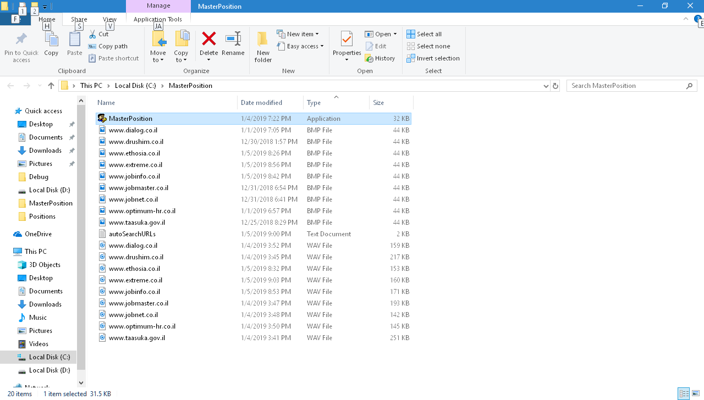
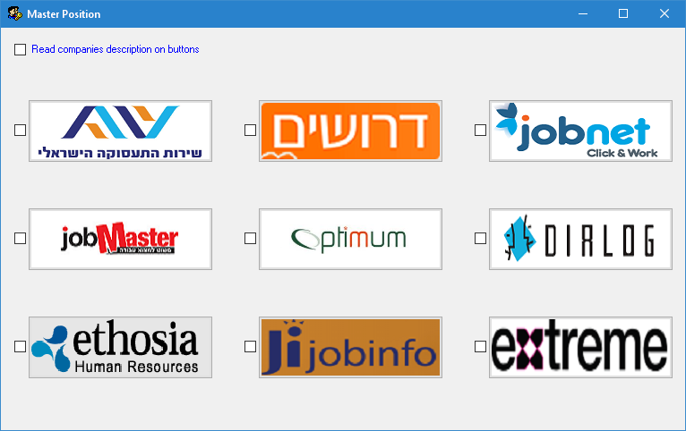
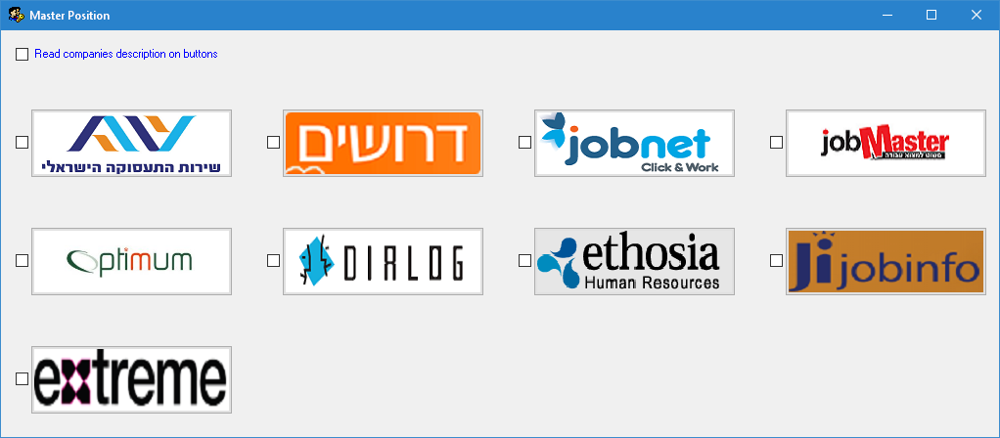

**Master Position**

**Makes job search easy and simple**

Notice: all additional files (autoSearchURLs.txt, .bmp and .wav files)

MUST be located in the executable folder (where MasterPosition.exe file is
located):

The Main screen of the application looks like that:

Now, we can:

-   Click on a button-\> goes directly to the main page of the jobs site

-   Check ON the Auto Search checkbox, on the left of a jobs site,

then click on the corresponding jobs site button-\> goes directly to the search
results page of the jobs site, according to the predefined search criteria

(this is the actual use of the file *autoSearchURLs.txt*)

-   Check ON the "Read companies description on buttons" checkbox,

then hover the mouse over a jobs site button-\> the jobs site name will be read
aloud.

-   Resize the window-\> the buttons will be arranged accordingly:

**Code location:**
<https://github.com/LiorBob/MasterPosition/blob/master/MasterPosition/frmMasterPosition.cs>

**YouTube demo:**

<https://www.youtube.com/watch?v=TG51E36PkXw>
